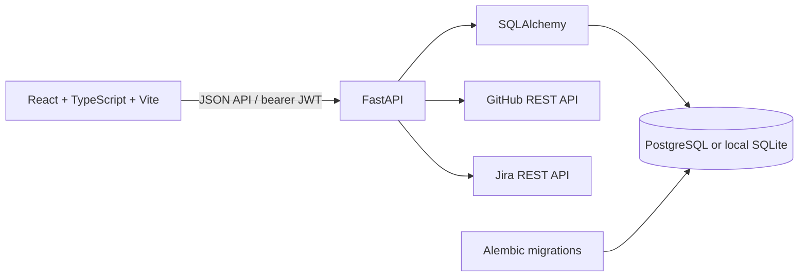

# ATLAS

ATLAS is an engineering knowledge continuity application. Its intended purpose is to make system context, knowledge gaps, and handovers easier to inspect and validate. This repository currently contains a working demo/MVP foundation, not a production-complete continuity platform. This README distinguishes implemented behavior from demo-only screens and unfinished integrations.

## Contents

- [Current capabilities](#current-capabilities)
- [Technology stack](#technology-stack)
- [Architecture](#architecture)
- [Prerequisites](#prerequisites)
- [Run locally on Windows](#run-locally-on-windows)
- [Demo accounts](#demo-accounts)
- [Configuration](#configuration)
- [Database and migrations](#database-and-migrations)
- [Backend API](#backend-api)
- [Frontend routes and roles](#frontend-routes-and-roles)
- [Integrations](#integrations)
- [Tests and builds](#tests-and-builds)
- [Known limitations](#known-limitations)
- [Security notes](#security-notes)

## Current capabilities

### Authentication and roles

- Login checks a user in the database and verifies the Argon2 password hash.
- Successful login returns a JWT signed using HS256.
- Protected API endpoints validate the bearer token, confirm that the user is active, and apply role checks where configured.
- The product has four roles: `manager`, `holder`, `incoming`, and `admin`.
- The frontend clears the saved token on logout and redirects protected pages to login when there is no authenticated user.

### Knowledge gaps and capture

- Authenticated users can list and inspect organization-scoped knowledge gaps.
- Managers and knowledge holders can submit an answer. The answer is persisted as a proposed `KnowledgeRecord`; submission alone does not validate the gap.
- Knowledge records can be listed for a gap, including proposal status and submitter/validator names.
- Managers can approve, reject, or request clarification on a proposed record. Approval marks the record and the gap as validated.
- Submission and review actions create audit-log entries.
- Gap and review lookups are scoped to the authenticated user's organization.

### Demo workspace

The seed script creates a FinPay / Engineering organization, five teams, five services, four demo users, knowledge areas, and three sample knowledge gaps. The front end includes overview, knowledge map, risk-area, knowledge, transition, integration, and administration views. Many values on those screens are illustrative demo content and should not be interpreted as live measurements; see [Known limitations](#known-limitations).

## Technology stack

| Area | Technology |
| --- | --- |
| Frontend | React, TypeScript, Vite, React Router, Lucide React |
| Backend | Python, FastAPI, Pydantic, Uvicorn, HTTPX |
| Persistence / ORM | SQLAlchemy 2 |
| Migrations | Alembic |
| Database | PostgreSQL with Psycopg; SQLite can be used for local demo development |
| Authentication | JWT / HS256 and Argon2 password hashing |
| External APIs | GitHub REST API and Jira REST API |

The frontend manifest currently uses `latest` for React, Vite, TypeScript, React Router, Lucide React, and the Vite React plugin. Python was exercised with version 3.12 in development. See `frontend/package.json` and `backend/requirements.txt` for dependency declarations.

## Architecture



The frontend API wrapper is in `frontend/src/api.ts`; shared frontend session and page state live in `frontend/src/store.tsx`. FastAPI endpoints are currently collected in `backend/app/main.py`. SQLAlchemy entities live in `backend/app/models/entities.py`.

## Prerequisites

- Python 3.12 or a compatible Python version supported by the listed backend dependencies.
- Node.js and npm.
- GitHub/Jira credentials only if you intend to try their current summary-sync endpoints.
- For PostgreSQL operation, a reachable PostgreSQL database. Local demo development can use SQLite instead.

## Run locally on Windows

Commands below are for PowerShell from the repository root. The repository may already have a virtual environment at `venv`; create one if it does not exist.

### 1. Install backend dependencies

```powershell
py -3.12 -m venv venv
.\venv\Scripts\Activate.ps1
python -m pip install -r backend\requirements.txt
```

If the virtual environment already exists, activate that environment and install the requirements instead of recreating it.

### 2. Initialize and seed a local SQLite database

The backend loads `backend/.env` if present. `SUPABASE_DATABASE_URL` takes precedence over `DATABASE_URL`, so explicitly set both variables in the current PowerShell session when choosing SQLite.

```powershell
Set-Location backend
$env:SUPABASE_DATABASE_URL = 'sqlite:///./atlas-runtime.db'
$env:DATABASE_URL = 'sqlite:///./atlas-runtime.db'
..\venv\Scripts\python.exe -m alembic upgrade head
..\venv\Scripts\python.exe -m app.seed
```

The seed is designed to add the sample FinPay data without re-creating existing seed rows. Keep this database for local demo use; do not use it as a substitute for a production database.

### 3. Start the API

Keep both database variables set in the terminal running the server:

```powershell
Set-Location backend
$env:SUPABASE_DATABASE_URL = 'sqlite:///./atlas-runtime.db'
$env:DATABASE_URL = 'sqlite:///./atlas-runtime.db'
..\venv\Scripts\python.exe -m uvicorn app.main:app --reload --host 127.0.0.1 --port 8000
```

- API base URL: `http://127.0.0.1:8000`
- Health check: `http://127.0.0.1:8000/health`
- Interactive API docs: `http://127.0.0.1:8000/docs`

### 4. Start the frontend

Open a second PowerShell terminal at the repository root:

```powershell
Set-Location frontend
npm install
npm run dev -- --host 127.0.0.1 --port 5173
```

Open `http://127.0.0.1:5173/`. The frontend defaults to the API at `http://127.0.0.1:8000`; override it at build/runtime with the Vite variable `VITE_API_URL` if using another API URL.

## Demo accounts

After running the seed command, all demo users have the same development-only password, `demo-password`.

| Role | Email |
| --- | --- |
| Engineering Manager | `manager@finpay.demo` |
| Knowledge Holder | `arun@finpay.demo` |
| Incoming Engineer | `priya@finpay.demo` |
| Admin / CTO | `admin@finpay.demo` |

Do not use these accounts or their shared password outside a local demo environment.

## Configuration

`backend/.env.example` lists backend environment variables. Copy it to `backend/.env` and set the values required for your environment. The `.env` file is ignored by Git; never commit secrets.

| Variable | Purpose |
| --- | --- |
| `DATABASE_URL` | PostgreSQL connection URL, or a local SQLite URL for development. |
| `SUPABASE_DATABASE_URL` | Optional PostgreSQL connection URL; when set, it takes precedence over `DATABASE_URL`. |
| `CORS_ORIGINS` | Comma-separated allowed browser origins. Defaults to local Vite origins. |
| `JWT_SECRET` | Secret used to sign JWTs. Replace the example value with a long random secret outside local demos. |
| `JWT_EXPIRE_MINUTES` | JWT expiration time in minutes. |
| `GITHUB_TOKEN` | GitHub personal/access token used by the current server-side client. Keep it on the backend. |
| `GITHUB_ORG` | GitHub organization to query. |
| `GITHUB_OWNER` | GitHub user/owner to query when not using an organization. |
| `JIRA_BASE_URL` | Jira site URL, for example `https://company.atlassian.net`. |
| `JIRA_EMAIL` | Jira account email used for basic API authentication. |
| `JIRA_API_TOKEN` | Jira API token. Keep it on the backend. |
| `JIRA_PROJECT_KEYS` | Comma-separated project keys used in Jira issue search. |

The current implementation does not use GitHub OAuth or Jira OAuth. Do not put private credentials in frontend variables or bundle them into the client. For a local SQLite run, set both database variables explicitly as shown above, because a non-empty `SUPABASE_DATABASE_URL` overrides the local URL.

## Database and migrations

The main entities currently model:

- Organizations, users, and teams.
- Services and repositories.
- Knowledge areas, knowledge gaps, source evidence, and knowledge records.
- Transitions and transition knowledge areas.
- Integrations, audit logs, and notifications.

Apply schema migrations from `backend/`:

```powershell
..\venv\Scripts\python.exe -m alembic upgrade head
```

Current migrations are in `backend/alembic/versions/`. The initial migration creates the base schema; the next migration records who submitted a knowledge record. `python -m app.seed` creates the demo organization and its seed data.

## Backend API

Authentication is bearer-token based. Except for health, login, and the current integration status route, API data routes require an `Authorization: Bearer <token>` header.

| Method | Path | Behavior |
| --- | --- | --- |
| `GET` | `/health` | API health status. |
| `POST` | `/api/auth/login` | Verify credentials and issue JWT. |
| `GET` | `/api/me` | Return the authenticated database user. |
| `GET` | `/api/workspace` | Return workspace metadata and last GitHub sync time; several counts are currently demo constants. |
| `GET` | `/api/integrations` | Report whether GitHub/Jira environment credentials are present. This is not an OAuth connection flow. |
| `POST` | `/api/integrations/{provider}/sync` | Call the configured GitHub/Jira summary client; restricted to manager/admin. |
| `GET` | `/api/knowledge-gaps` | List gaps for the authenticated organization. |
| `GET` | `/api/knowledge-gaps/{gap_id}` | Get a gap by title-derived slug within the authenticated organization. |
| `POST` | `/api/knowledge-gaps/{gap_id}/capture` | Save an answer as a proposed knowledge record; manager/holder only. |
| `GET` | `/api/knowledge-gaps/{gap_id}/records` | List persisted knowledge proposals and review states for the organization. |
| `POST` | `/api/knowledge-gaps/{gap_id}/records/{record_id}/validate` | Approve, reject, or request clarification; manager only. |

FastAPI-generated OpenAPI documentation is available at `/docs` while the API is running.

## Frontend routes and roles

The role-based navigation preserves four product roles:

- **Manager:** overview, knowledge map, risk areas, knowledge gaps, transitions, integrations, settings.
- **Knowledge Holder:** my knowledge, knowledge gaps, pending validation, records, profile/settings.
- **Incoming Engineer:** transition, knowledge areas, knowledge checks, completed transition, profile/settings.
- **Admin:** organization, teams/members, roles/permissions, integrations, data sync, security, audit log, settings.

Routes are implemented inside `frontend/src/App.tsx`. Some pages are presentational demo views and are not yet backed by CRUD APIs. The demo-role switch in the sidebar is a frontend convenience and does not provide secure role switching; backend authorization remains the security boundary.

## Integrations

### GitHub

Set `GITHUB_TOKEN` and either `GITHUB_ORG` or `GITHUB_OWNER` on the backend. The client requests repositories, pull requests, and contributors. The sync endpoint returns summary counts and records the last sync time in the integration row after the provider calls succeed.

### Jira

Set `JIRA_BASE_URL`, `JIRA_EMAIL`, and `JIRA_API_TOKEN`; optionally set `JIRA_PROJECT_KEYS`. The client requests project and issue summaries. The sync endpoint returns summary counts and records the last sync time after successful provider requests.

These are initial summary clients, not complete ingestion pipelines. They do not yet persist repository, pull request, contributor, or Jira project/issue records; pagination is not implemented; and the UI does not implement an OAuth authorization/callback flow or project/repository selection. A successful summary request should not be interpreted as source records being imported or analyzed.

## Tests and builds

### Backend tests

`pytest` is used by the current focused API tests but is not currently listed in `backend/requirements.txt`. Install it in the virtual environment, then run from `backend/`:

```powershell
python -m pip install pytest
python -m pytest tests -q
```

Current tests exercise knowledge submission persistence, manager-only review, audit log entries, and organization isolation for review lookup.

### Frontend production build

Run from `frontend/`:

```powershell
npm run build
```

This runs the TypeScript project build and Vite production bundle. There is no frontend test or lint script configured in `frontend/package.json` at present.

## Known limitations

This codebase is still a demo/MVP and is not production-ready. In particular:

- Dashboard and risk metrics, team/admin tables, knowledge-map nodes, some evidence references, and several transition statistics are hard-coded demo data.
- Transition creation, progress, and knowledge checks are currently frontend state; they are not a persisted end-to-end transition workflow.
- GitHub and Jira clients fetch limited summary data only. Source data is not ingested/upserted into the database, and paging/retry/rate-limit handling is incomplete.
- Integration status initially reflects whether credentials are configured, not an independently verified durable authorization. There is no OAuth connection lifecycle or secure per-organization credential storage.
- The workspace API returns demo counts, regardless of actual database totals.
- Teams, users, permissions, settings, notifications, evidence views, audit-log views, and most admin actions do not yet have complete backend operations.
- Knowledge gaps in the seeded workspace are sample/demo rows, not generated from an evidence analysis engine. The current app has no deterministic continuity-analysis engine or AI feature.
- The model includes several planned entities, but their existence does not mean their workflows are implemented.
- `backend/.env` may point to a remote Supabase database. If that host is unreachable, API database operations fail even if `/health` responds. Use the local SQLite setup above for an isolated demo, or configure a reachable database URL.

Use clear demo labels when showing seeded/static values. Do not use the current metrics, integrations, or transition pages to make operational or personnel decisions.

## Security notes

- Keep `backend/.env` out of version control and rotate any credential that has been exposed.
- Use a unique, long `JWT_SECRET` outside local development; the default in source is not suitable for production.
- Keep GitHub and Jira tokens on the backend only.
- Demo users share a known password; disable or replace them before exposing a deployment.
- Review organization scoping and role checks whenever adding a route. Frontend-only route hiding is not authorization.
- The current integration and data flows have not had a production security review.
